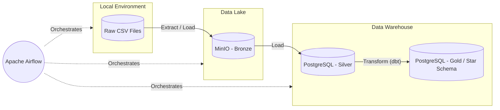

# 🛒 Olist E-Commerce ELT Pipeline

An end-to-end, batch data pipeline built entirely with free, open-source tools running locally via Docker. This project ingests raw e-commerce data from a local directory into a Data Lake, loads it into a PostgreSQL Data Warehouse, and transforms it into an analytics-ready Star Schema using dbt.

---

## 🏗️ Architecture

The pipeline follows a Medallion Architecture (Bronze, Silver, Gold) and an **ELT (Extract, Load, Transform)** pattern.



---

## 🛠️ Tech Stack

* **Orchestration:** [Apache Airflow](https://airflow.apache.org/) 
* **Data Lake (Object Storage):** [MinIO](https://min.io/) (S3-compatible)
* **Data Warehouse:** [PostgreSQL](https://www.postgresql.org/)
* **Data Transformation:** [dbt (Data Build Tool)](https://www.getdbt.com/)
* **Containerization:** [Docker Compose](https://www.docker.com/)

---

## 📂 Project Structure

```text
olist-ecommerce-pipeline/
├── dags/                  # Airflow DAGs (Ingestion, Loading, Transformation)
├── data/                  # Raw dataset directory (Ignored by Git)
├── dbt/                   # dbt project (Models, tests, profiles)
│   ├── models/            # SQL transformations (Staging & Marts)
│   ├── dbt_project.yml    # dbt configuration
│   └── profiles.yml       # dbt connection profiles
├── logs/                  # Airflow logs (Ignored by Git)
├── docker-compose.yml     # Infrastructure configuration
├── init.sql               # PostgreSQL initialization script
└── README.md              # Project documentation
```

---

## 🚀 How to Run the Pipeline

### 1. Prerequisites
* Ensure you have [Docker](https://www.docker.com/) and Docker Compose installed on your machine.
* Ensure you have Git installed.

### 2. Download the Dataset
This project uses the **[Olist Brazilian E-Commerce Dataset](https://www.kaggle.com/datasets/olistbr/brazilian-ecommerce)** from Kaggle.
1. Download the dataset archive (`.zip`).
2. Extract the `.csv` files.
3. Place all the extracted `.csv` files directly into the `data/` folder in the root of this project. *(Note: The `data/` folder is ignored by git to keep the repository lightweight).*

### 3. Spin Up the Infrastructure
Open your terminal in the root directory of the project and run:
```bash
docker-compose up -d
```
This will download the necessary images and spin up MinIO, PostgreSQL, and all Apache Airflow components.

### 4. Trigger the Pipeline
1. Open your browser and navigate to the Airflow UI at `http://localhost:8080`.
2. **Login:** Username: `admin` | Password: `admin`
3. You will see three DAGs. Unpause the toggle next to them and run them in this specific order:
   * **`ingest_to_minio`**: Reads the CSV files from the `data/` folder and uploads them to a `raw-data` bucket in MinIO.
   * **`load_to_postgres`**: Reads the data from MinIO and inserts it into raw (Silver layer) tables in PostgreSQL.
   * **`dbt_transform`**: Runs dbt to clean the raw tables and organize them into an analytics-ready Star Schema (Gold layer).

### 5. Verify the Results
Once the pipeline has finished running successfully, your PostgreSQL `warehouse` database will be fully populated. You can connect to the database (using DBeaver, pgAdmin, or your terminal) at `localhost:5432` with the credentials `airflow/airflow` to query your newly created Star Schema!

---

## 🛑 Teardown
To stop all services and remove the containers, run:
```bash
docker-compose down
```
If you wish to wipe the volumes (database data and MinIO data) as well, run:
```bash
docker-compose down -v
```
